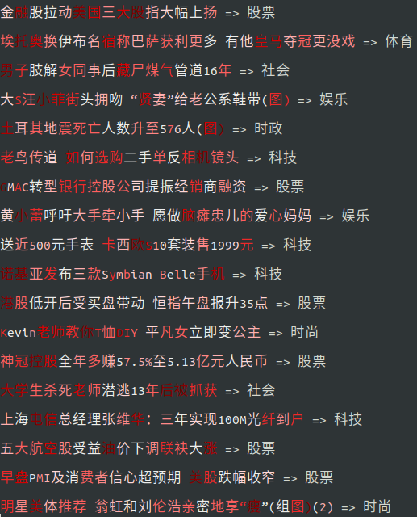
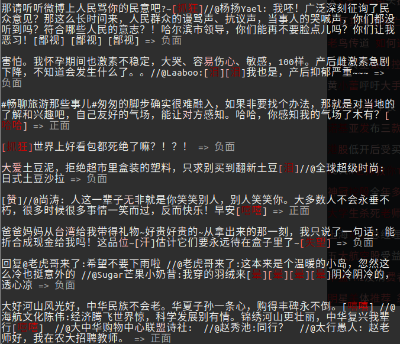
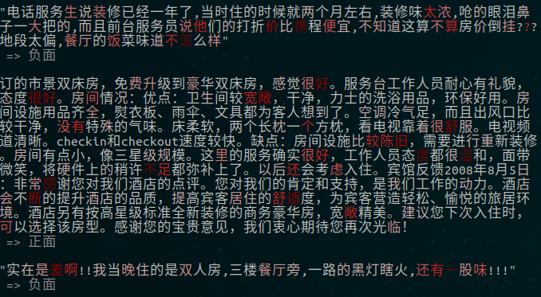
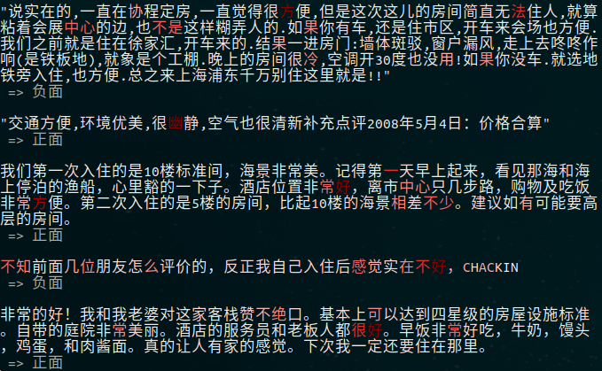

# text-globalmaxpool-visualization

NLP中，我们常常使用AttentionPooling对词向量序列进行聚合作为句向量的表示，在[text-attentionpooling-visualization](https://github.com/allenwind/text-attentionpooling-visualization)分析过，有不错的效果。此外，还常常使用MaxPooling和AveragePooling对词向量序列进行聚合（句向量），其中AveragePooling可以看做是AttentionPooling的特例。这里只探讨MaxPooling，如Tensorflow中的`tf.keras.layers.GlobalMaxPool1D`。这里尝试可视化MaxPooling的效果。一个词向量序列可以用矩阵表示，其维度为(maxlen, hdims)，MaxPooling操作后，变为向量，可以看做句向量的表示，其维度为(1, hdims)。hdims每个值对应着某个词向量的最大值，把其作为该词在下游任务中重要性的权重，并通过可视化来观察是否具有预期的效果。


带词重要性权重输出的MaskGlobalMaxPooling1D的实现：

```python
class MaskGlobalMaxPooling1D(tf.keras.layers.Layer):
    
    def __init__(self, **kwargs):
        super(MaskGlobalMaxPooling1D, self).__init__(**kwargs)

    def call(self, inputs, mask=None):
        if mask is None:
            mask = 1
        else:
            # 扩展维度便于广播
            mask = tf.expand_dims(tf.cast(mask, "float32"), -1)
        x = inputs
        x = x - (1 - mask) * 1e12 # 用一个大的负数mask
        x = tf.reduce_max(x, axis=1, keepdims=True)
        ws = tf.where(inputs == x, x, 0.0)
        ws = tf.reduce_sum(ws, axis=2)
        x = tf.squeeze(x, axis=1)
        return x, ws
```


分类问题效果一：



分类问题效果二：



分类问题效果三：



分类问题效果四：



可以看到，MaxPooling在文本问题上也是能够定位到关键信息作为分类依据。Pooling后的句向量的每个元素能够反映其所对应的字或词的重要性。
